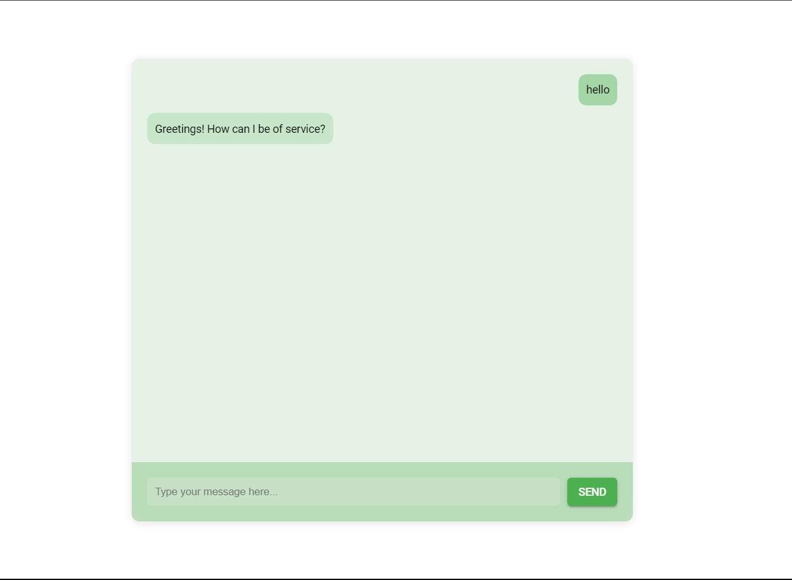

# Find Your Doctor (Chatbot Application)



## What

This project is a simple web-based chatbot application built using Flask, TensorFlow, and Material Design Lite. The chatbot responds to user inputs based on a pre-trained model.

## How

1. **Clone the Repository**
    ```sh
    git clone <repository-url>
    cd project
    ```

2. **Create and Activate Virtual Environment**
    ```sh
    python -m venv venv
    source venv/bin/activate  # On Windows use `venv\Scripts\activate`
    ```

3. **Install Dependencies**
    ```sh
    pip install -r requirements.txt
    ```

4. **Prepare and Train the Model**
    - Ensure `intents.json` is in the `data` directory.
    - Run the training script:
      ```sh
      python trainingmodel.py
      ```

5. **Run the Flask Application**
    ```sh
    python main.py
    ```

## View

- **Open your web browser** and navigate to `http://127.0.0.1:5000` to interact with the chatbot interface.

- **Chat Interface**: 
  - The chat interface consists of a chat box where messages are displayed and an input area where you can type and send your messages.
  - The chatbot's responses will appear in the chat box as you interact with it.

  
